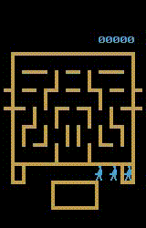

# Distributed reinforcement learning based on Ray

A PyTorch implementation of reinforcement lerning algorithms

## What implemented
* DQN
* DDQN
* Distributed
* Prior replaybuffer

## What implementing
* R2D2

## What to implement
* Multi-step learning
* ...

## What special compared to other implementions
* Compressing is used before observations saved into replay buffer, so only 1~3GB RAM will be used to keep 1M history observations.

## Some result
* DQN

* DDQN

    |**Game**             | Zaxxon                          | Asterix                           | WizardOfWor                               |
    |:-------------------:|:-------------------------------:|:---------------------------------:|:-----------------------------------------:|
    |**Result**           | |  |      |
    |**Noop Start Score** | [10910.5](./exp/ddqn/Zaxxon.png)| [25500.75](./exp/ddqn/Asterix.png)| [6034.0](./exp/ddqn/WizardOfWor.png)      |

* Prior DDQN

    |**Game**             | Zaxxon                                 | Asterix                                | WizardOfWor                                 |
    |:-------------------:|:--------------------------------------:|:--------------------------------------:|:-------------------------------------------:|
    |**Result**           |  | |  |
    |**Noop Start Score** | [16021.5](./exp/prior_ddqn/Zaxxon.png) |[41296.25](./exp/prior_ddqn/Asterix.png)| [10928.0](./exp/prior_ddqn/WizardOfWor.png) |

## How to use

* DQN with an uniform replay buffer

    nohup python -u main.py Asterix --alg=DQN --buffer=mmdb --num_agents=4 --num_loaders=6 --batch_size=256 --lr=0.625e-4 --suffix="DQN" --speed=8 >train.txt 2>&1 &

* DDQN with an uniform replay buffer

    nohup python -u main.py Asterix --alg=DDQN --buffer=mmdb --num_agents=4 --num_loaders=6 --batch_size=256 --lr=0.625e-4 --suffix="DDQN" --speed=8 >train.txt 2>&1 &

* DDQN with a prior replay buffer

    nohup python -u main.py Asterix --alg=DDQN --buffer=pmdb --num_agents=4 --num_loaders=6 --batch_size=256 --lr=0.150e-4 --suffix="DDQN" --speed=8 >train.txt 2>&1 &

* Test with a trained model

    python main.py WizardOfWor --test --suffix="DDQN_gn_normal0" --resume ./model/DQN_BasicNet/WizardOfWorNoFrameskip-v4/DDQN_gn_normal0/iter_3600000K.pkl

## Some notes
1. Group norm is added to origin Deepmind's network for less hyperparameter tuning and more consistent learning curve. You will have a insight to the consistent problem in Origin network with ut test "test_convengence" in ./test/test_opt.py even simply using Pong env.
2. The code supports one machine multi-gpu training, but not supports multi-machine training
3. On AMD 2700 and 2070S it takes about 2 days to gather 200M enveriment steps with 4 agents and train the model.

