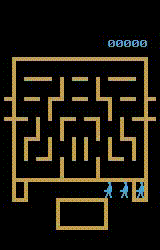

# Distributed reinforcement learning based on Ray

A PyTorch implementation of reinforcement lerning algorithms

## What implemented
* DQN
* DDQN
* Distributed

## What implementing
* Prior replaybuffer

## What to implement
* Multi-step learning
* R2D2
* ...

## What special compared to other implementions
* Compressing is used before observations saved into replay buffer, so only 1~3GB RAM will be used to keep 1M history observations.

## Some result
* DQN

* DDQN

    | [Zaxxon](./exp/ddqn/Zaxxon.png) | [Asterix](./exp/ddqn/Asterix.png) | [WizardOfWor](./exp/ddqn/WizardOfWor.png) |
    |:-------------------------------:|:---------------------------------:|:-----------------------------------------:|
    | |  |      |

## How to use

* DQN with an uniform replay buffer

    nohup python -u main.py Asterix --alg=DQN --buffer=mmdb --num_agents=4 --num_loaders=6 --batch_size=256 --lr=0.625e-4 --suffix="DQN" --speed=8 >train.txt 2>&1 &

* DDQN with a prior replay buffer

    nohup python -u main.py Asterix --alg=DDQN --buffer=pmdb --num_agents=4 --num_loaders=6 --batch_size=256 --lr=0.625e-4 --suffix="DDQN" --speed=8 >train.txt 2>&1 &

* Test with a trained model

    python main.py WizardOfWor --test --suffix="DDQN_gn_normal0" --resume ./model/DQN_BasicNet/WizardOfWorNoFrameskip-v4/DDQN_gn_normal0/iter_3600000K.pkl

